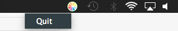

# Juce Simples exemples
Des exemples très simples réalisé avec Juce

* SplashScreen -> Affiche une image d'accueil (Splash) à l'ouverture de l'application

* KnobImage -> Potentiomètre rotatif customisé par une image
              (Slider, LookAndFeel)
              
        
* TaskBar -> affiche un menu dans la barre des tâches

 
              
