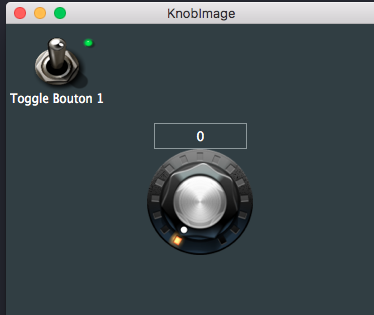
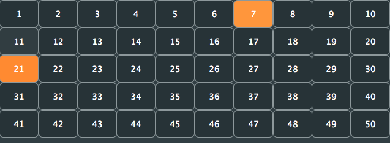

# Juce Simples exemples
Des exemples très simples réalisé avec Juce, débutant avec Juce c'est un peu mon carnet de notes que je partage...

* SplashScreen -> Affiche une image d'accueil (Splash) à l'ouverture de l'application
* Traduire -> un petit exemple pour implémenter la localisation.
* Properties -> Un exemple d'utilisation d'ApplicationProperties (sauvegarde de la taille de la fenêtre)
* Undo -> Implémente undo/redo (annuler / refaire) à 2 Sliders (Utilise ValueTree et UndoManager)
* KnobImage -> Potentiomètre rotatif customisé par une image
              (Slider, LookAndFeel)
              
* ToggleImage -> la suite de knobImage, ici on personnalise les ToggleButton
         
* TaskBar -> affiche un menu dans la barre des tâches

     
    
* Grille -> ajoût d'objet dans un array et alignement en grille
     
* PositionSouris -> Comment afficher une ligne verticale et horizontale qui suivent la souris
     
